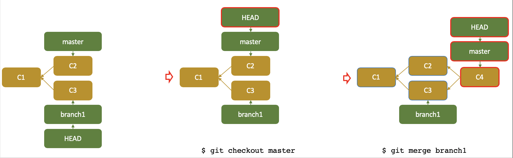

I use this page for archiving what I learned about Git,
 mostly from [Pro Git](https://git-scm.com/book/en/v2). 

- [Install Git](#install-git)
- [Basics](#basics)
  - [File status](#file-status)
  - [Help](#help)
- [Config](#config)
- [Initialization](#initialization)
  - [Initializing](#initializing)
  - [Cloning](#cloning)
- [Recording Changes](#recording-changes)
  - [Tracking](#tracking)
  - [Staging](#staging)
  - [Ignoring Files](#ignoring-files)
  - [Commit](#commit)
- [Viewing Changes](#viewing-changes)
  - [Unstaged vs staged](#unstaged-vs-staged)
  - [Staged vs committed](#staged-vs-committed)
- [Viewing the Commit History](#viewing-the-commit-history)
- [Undoing changes](#undoing-changes)
- [Branch](#branch)
  - [Merging](#merging)
  - [Conflict](#conflict)
- [Tagging](#tagging)
- [Bug Fix](#bug-fix)
  - [Bug search](#bug-search)
  - [Correcting bugs](#correcting-bugs)
- [Remotes](#remotes)
  - [Cloning](#cloning-1)
  - [Fetching](#fetching)
  - [Pulling](#pulling)
  - [Pushing](#pushing)
<!-- --------------------------------------------------------------- -->
# Install Git
Install Git from [git-scm.com](https://git-scm.com/).

<!-- --------------------------------------------------------------- -->
# Basics
Git store data as a series of snapshots of directory.

- **Working Directory**: a single checkout of one version of the project.
- **Staged Files**: where Git stores will go into your next commit.
- **Committed Files**: where Git stores the snapshots of the project. 
  <!-- FIGURE 1 -->
.

When one **stages**, Git
- computes a checksum for each file (the SHA-1 hash)
- stores that version of the file in the Git repository (Git refers to them as blobs)

When one **commits**, Git stores a commit object that contains:
- a pointer to the snapshot of the content you staged.
- author’s name and email
- commit message
- pointers to the commit or commits that directly came before this commit (its parent or parents): 
    - zero parents for the initial commit
    - one parent for a normal commit
    - multiple parents for a commit that results from a merge of two or more branches
  
In general, git repository has the following objects:
- blobs (each representing the contents of files)
- a tree that lists the contents of the directory and specifies which file names are stored as which blobs
- commit with the pointer to that root tree and all the commit metadata

## File status
Check files status:
```git
git status
```
## Help
Get help about any keyword:
```git
git help <verb>
```
Get the more concise help:
```git
git <verb> -h
```


# Config

Change username and email
```git
git config --global user.name "<my_name>"
git config --global user.email <my_email>
```
To override the global config, run it without `--global`.


# Initialization

## Initializing 
Initialize a repository in an existing directory:
- change directory:
```git
cd <repository-directory>
```
- initialize Git:
```git
git init
```
## Cloning 
Clone an existing remote repository: 
```git
git clone <url>
```


# Recording Changes

## Tracking
Track new files:
```git
git add <file_name>
```

## Staging
Stage modified files:
```git
git add <file_name>
```

## Ignoring Files
Create a `.gitignore` file in the repository directory similar to:
```git
# ignore all .a files
*.a
# but do track lib.a, even though .a are ignored
!lib.a
# only ignore the TODO file in the current directory, not subdir/TODO
/TODO
# ignore all files in any directory named build
build/
# ignore doc/notes.txt, but not doc/server/arch.txt
doc/*.txt
```
## Commit  
Commit *staged* changes:
```git
git commit -m "<my_message>"
```


# Viewing Changes

## Unstaged vs staged
Show difference between unstaged (working directory) vs staged:
```git
git diff [<file_name>]
```

## Staged vs committed
Show Difference between staged vs committed:
```git
git diff --staged [<file_name>]
```
Use `git difftool` instead of `git diff` for more visual comparison.

**NOTE:** 
Git diff header is in the form of 
`@@ \<preimage-file-range> \<postimage-file-range> @@`.

where
- `file-range` is in the form `-\<start-line>,\<number-of-lines>`  
- `•`: The lines common to both files.
- `+`: A line was added here to the first file.
- `-`: A line was removed here from the first file.


# Viewing the Commit History
List the previous commits:
```git
git log [option]
```
Options:
- `--patch`: shows the difference introduced in each commit
- `--oneline`: prints each commit on a single line
- `--oneline --graph`: adds a little ASCII graph showing your branch and merge history
- `--since "DEC 1 2014" --until "DEC 5 2014"`: shows commits between two dates
- `-S <a_string>`: show commits changing the number of occurrence of the string
  
Show the changes happened in a commit:
```git
git show <commit_hash>
```

Show who made the changes:
```git
git blame <file_name> -L<line_number>
```


# Undoing changes
Unstage a staged file:
```git
git reset HEAD <file_name>
```

Revert the *working directory* back to the last committed
```git
git checkout -- <file_name>
```


# Branch

A branch is a movable pointer to a commit. 
Every time a commit is made, the current branch pointer moves forward automatically.

Git uses `HEAD` to know the current branch. 
`HEAD` is a pointer that always points to the current branch.

When a new branch is created, Git creates a new pointer to move around. 

  <!-- FIGURE 2 -->


Create a branch (it just creates the branch without switching to that branch):
```git
git branch <branch_name>
```

Switching to a branch (Git moves HEAD to point to the that branch):
```git
git checkout <branch_name>
```

List branches:
```git
git branch [options]
```
Options:
- `-a`:list local and remote branches
- `-v`:show the last commit on each branch

Delete a branch:
```git
git branch -d <branch_name>
```

## Merging
Merge branches
```shell
git checkout <target_branch>
git merge <source_branch>
```
When there is no divergent work between *source branch* and *target branch*, Git simply move *target branch* pointer forward.
This is called “fast-forward” merge.
  <!-- FIGURE 3 -->


When the development history has diverged from some older point, i.g. the commit on the *target branch* isn’t a direct ancestor of *source branch*, Git does merging by creating a merge commit that has two parents.
  <!-- FIGURE 4 -->


## Conflict
When there is discrepancy between the same part of the same file differently of the two branches being merged.
Merge conflict must be resolved manually or using `git mergetool`.


Stale branches are the ones that have already been removed from the remote, but are still locally available in "remotes/<name>".
To deletes all stale remote-tracking branches:
```git
git remote prune origin
```


# Tagging
List tags:
```git
git tag
```

Annotate tag:
```git
git tag -a <tag_name> -m "<message>"
```

Tag a commit:
```git
git tag -a <tag_name> <commit_hash>
```

Show the tag data:
```git
git show <tag_name>
```

Push tag to a remote server
```git
git push <remote_name> <tag_name>.
```

Checkout a tag:
```git 
git checkout <tag_name>
```


# Bug Fix

## Bug search
To find the problematic commit, follow bisect (binary search commit) tool:

- start the process
```git
git bisect start
```
- Tell Git that the current commit is bad
```git
git bisect bad
```
- tell Git the good commit
```shell
git bisect good <commit>
```
Git suggests the next commit that needs to be checked.
 This process will be repeated until Git narrows the commits down to the problematic commit.  

## Correcting bugs

Checkout where the bug is added:
```git
git checkout <commit>
```
Git automatically create a *detached HEAD* from that commit.
- make changes; but your new commit won’t belong to any branch and will be unreachable, except by the exact commit hash
- commit changes
- create a new branch where you are, then switch to master and merge it


# Remotes

Lists each remote: 
```git
git remote [options]
```
Options:
- `-v`: shows remote URLs

Show lists the remote URLs and the tracking branch:
```git
git remote show <remote>
```

Add a new remote explicitly:
```git
git remote add <remote_name> <url>
```

Remove a remote:
```shell
git remote rm <remote_name>
```

## Cloning
Clone an existing remote repository to your local directory:
```git
git clone <remote_url>
```
Git’s clone command does the following automatically:
- names the remote `origin` for you, 
- pulls down all its data, creates a pointer to where its master branch is, and names it `origin/master` locally.
- creates a local `master` branch starting at the same place as origin’s master branch, so one has something to work from.
- sets up your local master branch to track the remote master branch (`origin/master`)

<!-- figure of cloning -->


## Fetching 
Downloads all branches from the remote (fetching is just downloading the data without merging):
```git
git fetch <remote_name>
```
<!-- figure of cloning -->


## Pulling
If your current branch is set up to track a remote branch, you can use the `git pull` to automatically fetch and then merge that remote branch into your current branch. 

Pull changes to a local directory
a pull is a fetch and a merge.
```git
git pull <remote-name> <remote_branch-name>:<local_branch_name>
```

## Pushing
Push changes to a remote server:
```git
git push <remote-name> <local-branch-name>:<remote_branch_name>
```
If a local branch is already tracking the remote branch, remote branch name can be omited.
